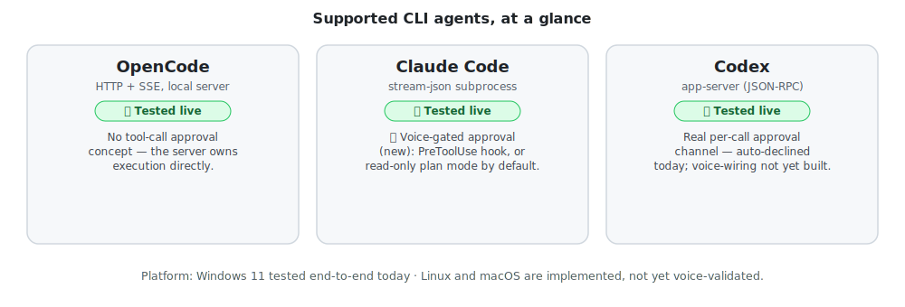
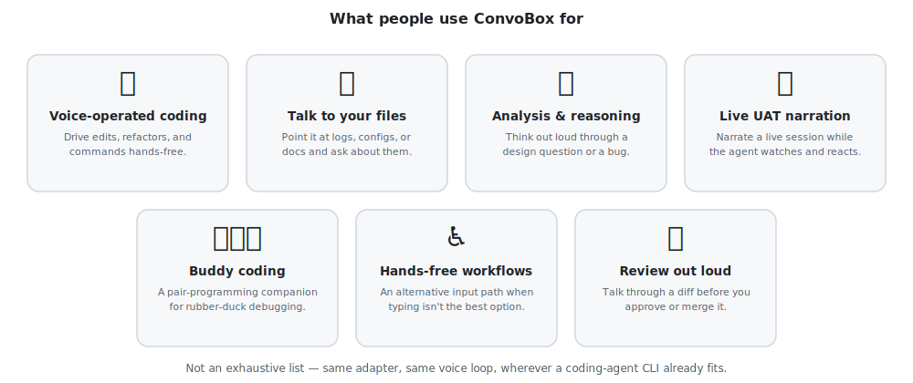
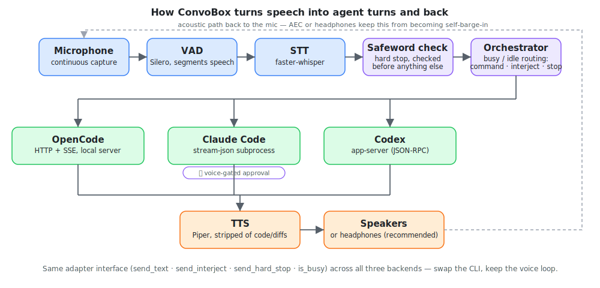

# LegionForge - ConvoBox

[](https://github.com/LegionForge/convobox/actions/workflows/ci.yml)
[](LICENSE)
[](pyproject.toml)

A local, backend-agnostic voice frontend for CLI coding agents. It sits
between you and whichever coding agent CLI you're driving — Claude Code,
Codex, OpenCode, and eventually others — and lets you work by voice
instead of (or alongside) the keyboard.

> **Headphones strongly recommended for now.** Acoustic echo cancellation
> (open mic + speakers, no headphones) is still being dialed in — see
> [docs/DESIGN-echo-and-barge-in.md](docs/DESIGN-echo-and-barge-in.md)
> for the live tuning notes. Headphones sidestep the whole problem: the
> assistant's own voice never reaches the mic, so self-barge-in can't
> happen regardless of room acoustics. Open-speaker use works today but
> is the rougher edge of the experience.

AI-assisted change attribution is documented in
[docs/AI-ATTRIBUTION.md](docs/AI-ATTRIBUTION.md).
The repo also includes a commit template at [`.gitmessage.txt`](.gitmessage.txt)
for local AI-assisted commits.

## Quick Start

The fastest way to hear it work, no microphone required:

```bash
git clone https://github.com/LegionForge/convobox
cd convobox
uv sync                                # or: pip install -e .
cp convobox.example.yaml convobox.yaml # edit backend.url / tts.voice as needed

# start your backend first, e.g.: opencode serve
python scripts/run_convobox.py --text "Reply with one short sentence: it works."
```

What that actually looks like (real output, `backend: codex` in this case):

```
2026-07-22 15:25:53 WARNING backend.working_dir is unset: the codex agent will run in ConvoBox's own directory and can modify its source. Set backend.working_dir (or pass --working-dir) to an isolated workspace. See docs/DESIGN-backend-sandboxing.md.
2026-07-22 15:25:55 INFO backend=codex  voice=en_GB-alba-medium  safeword='stop stop stop'  pid=35228
2026-07-22 15:26:10 INFO response: it works.
```

(That working-dir warning is real and worth heeding — see
[docs/DESIGN-backend-sandboxing.md](docs/DESIGN-backend-sandboxing.md).)

If you hear a spoken reply, the whole pipeline (backend → TTS → speakers)
is working. Then go live and talk to it:

```bash
python scripts/run_convobox.py
```

For picking a voice, finding the right audio device, and everything else
between "installed" and "talking to it comfortably," see the full
[docs/QUICKSTART.md](docs/QUICKSTART.md) walkthrough — it also covers
how to interrupt/abort by voice and what each listening state looks like.

## Installation

**Prerequisites:** Python 3.12+, [git](https://git-scm.com/), and a
coding-agent CLI you can already reach on its own — OpenCode (runs a
local server), Claude Code, or Codex (both spawned as subprocesses).

```bash
git clone https://github.com/LegionForge/convobox
cd convobox
uv sync                    # or: pip install -e .
```

Optional extras, installed only if you want them:

```bash
uv sync --extra aec        # acoustic echo cancellation (WebRTC AEC3, Windows wheels)
uv sync --extra cuda       # GPU inference for STT (stt.device: cuda/auto), ~1GB, CUDA-only
uv sync --extra dev        # test/lint tooling
```

ConvoBox never bundles a speech engine you didn't ask for — the default
STT model (faster-whisper) and TTS voices (Piper) download the first
time you actually use them, not at install time.

**Supported today:**



| Axis        | Tested end-to-end                                                   | Implemented, not yet voice-validated |
|-------------|----------------------------------------------------------------------|---------------------------------------|
| **Platform**| Windows 11                                                            | Linux, macOS                         |
| **Backend** | opencode (HTTP+SSE), Claude Code (stream-json), Codex (app-server)   | —                                     |
| **STT**     | faster-whisper                                                        | —                                     |
| **TTS**     | Piper                                                                 | —                                     |

Known problems (and workarounds, like the WASAPI audio-output issue on
Windows) are tracked in [docs/KNOWN-ISSUES.md](docs/KNOWN-ISSUES.md).

**A safety note before you configure a backend:** by default ConvoBox runs
Claude Code with `--permission-mode plan` (read/explore/explain only, no
edits or commands) because headless mode has no way to answer a
permission prompt at runtime. Setting your own `--permission-mode
bypassPermissions` (or `--dangerously-skip-permissions`) in
`backend.command` removes every permission check — only do this in a
context you'd trust an unsupervised agent with, since voice input can be
misheard and there's no per-action confirmation yet. Details in
[docs/STATUS.md](docs/STATUS.md).

## Uninstallation

ConvoBox never installs anything outside the folder you cloned it into —
no services, daemons, or registry/system entries. To remove it:

1. **Delete the project folder.** This removes the cloned source, the
   `uv`/`pip` virtual environment, your `convobox.yaml` config, and any
   downloaded Piper voices (cached at `.models/piper/` inside the
   project).
2. **If you installed it into a different environment** with `pip install
   -e .` instead of `uv sync`, first run `pip uninstall convobox` in that
   environment.
3. **Optional — reclaim the STT model cache.** faster-whisper downloads
   its speech-to-text model into the shared Hugging Face cache
   (`~/.cache/huggingface` on Linux/macOS, `%USERPROFILE%\.cache\huggingface`
   on Windows), not into the project folder. Only delete this if you don't
   need it for other Hugging Face–based tools — it isn't ConvoBox-specific.

## What ConvoBox does

**This is a developer tool, not a general-purpose voice assistant.**
ConvoBox has nothing to say if you don't already run a coding-agent CLI —
there's no standalone use case for it today, by design rather than by
oversight. If that changes, it'll be a deliberate new target added
alongside this one, not a reframing of what's here.

ConvoBox is not tied to any single backend: the goal is a portable voice
setup you can point at whatever coding-agent CLI you're using that day,
rather than a feature bolted onto one product. A thin adapter interface
(`send_text`, `send_interject`, `send_hard_stop`, `is_busy`) is
implemented per backend, preferring each tool's native structured/headless
interface over scraping terminal output.



Not an exhaustive list — the same adapter and voice loop apply wherever a
coding-agent CLI already fits into how you work.

## Direction

- **Natural, full-duplex conversation, not push-to-talk.** Continuous
  listening with voice-activity detection, not hold-a-key-to-talk. You
  should be able to interject the way you would with a person, not wait for
  a turn.
- **Local-first.** Speech-to-text and text-to-speech run on-device by
  default. No audio has to leave the machine for the core loop to work.
  This isn't just a privacy preference: it avoids metered cloud STT/TTS
  billing, keeps the raw voice-processing step out of the token budget of
  whatever coding agent you're actually talking to, and gives you a local
  pipeline you can tune to your own voice. "Local" doesn't mean "hardcoded
  to the device in front of you," though — the capture/indicator layer and
  the actual STT/TTS compute should stay decoupled, so the heavy
  processing can later run on a beefier machine on your own private
  network (e.g. via Tailscale) with a thin client on a laptop or phone,
  without leaving infrastructure you control.
- **Backend-agnostic by design.** Same adapter interface as above,
  preferring each tool's native structured/headless interface (e.g.
  streamed JSON events, an HTTP+SSE server) over scraping terminal
  output, with a PTY/keystroke fallback where nothing better exists.
- **Two distinct interrupt semantics.** A *soft interject* ("oh, also—")
  shouldn't derail a long-running task; a *hard stop* (a deliberate,
  deterministic safeword) should abort it immediately. These are modeled
  separately rather than collapsed into one "interrupt" action.
- **Voice-aware, not voice-restricted, risk policy.** Destructive actions
  can warrant stricter confirmation when triggered by voice, given STT
  misrecognition and ambient-pickup failure modes that keyboard input
  doesn't have. That default should be configurable per user, not
  hardcoded — the same agency a keyboard session already has should be
  available on the voice side too.

## Status

All three backend adapters (OpenCode, Claude Code, Codex) have been
driven through the full live voice loop, including tool use, on Windows
11. Linux/macOS parity is on the roadmap
([docs/ROADMAP.md](docs/ROADMAP.md)); the support matrix above shows
exactly what's tested versus implemented-but-not-yet-validated.

Since the 0.2.0 release, a substantial interaction/safety bundle
(barge-in presets, a live conversation TUI, response tiering, a real
safety bug fixed in the Codex adapter, and more) has landed on `main` —
see [docs/STATUS.md](docs/STATUS.md) for the full narrative and
[CHANGELOG.md](CHANGELOG.md) for the formal per-release log. The same
document also covers the security + performance audit (7 bugs found and
fixed) and the full progress history.

## Architecture



Audio capture (continuous mic input, VAD-segmented into utterances) feeds
local STT, which is checked for a deterministic safeword before anything
else touches it. An orchestrator tracks each backend's busy/idle state
and routes an utterance as a fresh command, a soft interject, or a hard
stop through one of three backend adapters — OpenCode, Claude Code, or
Codex — each verified against a live instance. Backend replies stream
back through local TTS, stripped of code/diffs in favor of spoken prose.

See [docs/ARCHITECTURE.md](docs/ARCHITECTURE.md) for the full pipeline
diagrams, the component stack, and pointers into the codebase (including
three [CodeTour](https://marketplace.visualstudio.com/items?itemName=vsls-contrib.codetour)
walkthroughs in `.tours/`).

## Roadmap

Rough phased direction, not commitments: a native desktop client first,
then a browser client talking to a networked server over your own
private network, with mobile deprioritized but not designed away. Full
detail, including the near-term feature roadmap (pluggable STT/TTS
engines, safety tiers for destructive actions, wake word, session
persistence), is in [docs/ROADMAP.md](docs/ROADMAP.md).

## Prior art

ConvoBox is not the first attempt at voice-driven coding agents —
[VoiceMode](https://github.com/mbailey/voicemode),
[duck_talk](https://github.com/dhuynh95/duck_talk), and the built-in
`/voice` in Claude Code and Aider are the closest relatives, but none
combine backend-agnostic, local-first, and full-duplex in one project.
See [docs/PRIOR-ART.md](docs/PRIOR-ART.md) for the full comparison,
reusable building blocks, and [docs/LESSONS-FROM-VOICE-OPENCODE.md](docs/LESSONS-FROM-VOICE-OPENCODE.md)
for what an earlier, unreleased attempt at this same problem got wrong.

## Credits & attributions

ConvoBox is built on other people's code, models, and research. See
[CREDITS.md](CREDITS.md) for acknowledgments — the software and models it
depends on, the conversation-design research behind its turn-taking/barge-in
behavior ([docs/CONVERSATION-DESIGN-REFERENCES.md](docs/CONVERSATION-DESIGN-REFERENCES.md)),
and the voice-assistant interaction patterns it deliberately mirrors.

## License

MIT — see [LICENSE](LICENSE). Free for everyone, personal and commercial
use alike, in the spirit of the mostly MIT/BSD/Apache-2.0 dependencies
this project is built on. A split free/paid licensing model was
researched and considered, then decided against in favor of staying a
single, simple, unencumbered open-source project; ongoing development is
optionally supported via Patreon/Ko-fi rather than a commercial license
(links TBD).

One outstanding technical item this decision depends on: the current
default TTS engine, `piper-tts`, is GPL-3.0 and imported in-process,
which would make a distributed ConvoBox a GPL-encumbered mix rather than
cleanly MIT. See [DEPENDENCY_LICENSE_AUDIT.md](DEPENDENCY_LICENSE_AUDIT.md)
for the full audit — recommended fix is swapping the default engine to
Kokoro (Apache 2.0), not yet implemented.
