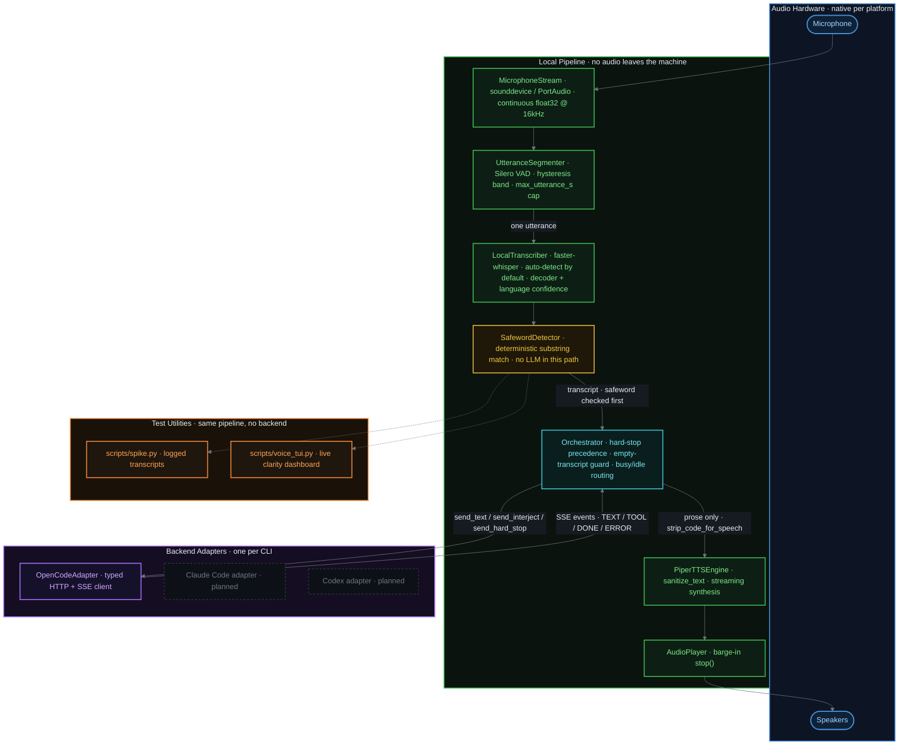
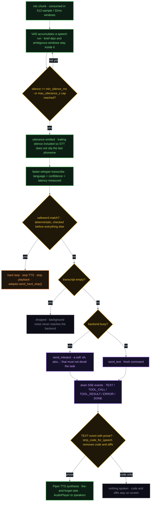

# ConvoBox

A local, backend-agnostic voice frontend for CLI coding agents.

## Purpose

ConvoBox sits between you and whichever coding agent CLI you're driving —
Claude Code, Codex, OpenCode, and eventually others — and lets you work by
voice instead of (or alongside) the keyboard. It is not tied to any single
backend: the goal is a portable voice setup you can point at whatever tool
you're using that day, rather than a feature bolted onto one product.

## Direction

- **Natural, full-duplex conversation, not push-to-talk.** Continuous
  listening with voice-activity detection, not hold-a-key-to-talk. You
  should be able to interject the way you would with a person, not wait for
  a turn.
- **Local-first.** Speech-to-text and text-to-speech run on-device by
  default. No audio has to leave the machine for the core loop to work.
  This isn't just a privacy preference: it avoids metered cloud STT/TTS
  billing, keeps the raw voice-processing step out of the token budget of
  whatever coding agent you're actually talking to, and gives you a local
  pipeline you can tune to your own voice. "Local" doesn't mean "hardcoded
  to the device in front of you," though — the capture/indicator layer and
  the actual STT/TTS compute should stay decoupled, so the heavy
  processing can later run on a beefier machine on your own private
  network (e.g. via Tailscale) with a thin client on a laptop or phone,
  without leaving infrastructure you control.
- **Backend-agnostic by design.** A thin adapter interface
  (`send_text`, `send_interject`, `send_hard_stop`, `is_busy`) is
  implemented per backend, preferring each tool's native structured/headless
  interface (e.g. streamed JSON events, an HTTP+SSE server) over scraping
  terminal output, with a PTY/keystroke fallback where nothing better
  exists.
- **Two distinct interrupt semantics.** A *soft interject* ("oh, also—")
  shouldn't derail a long-running task; a *hard stop* (a deliberate,
  deterministic safeword) should abort it immediately. These are modeled
  separately rather than collapsed into one "interrupt" action.
- **Voice-aware, not voice-restricted, risk policy.** Destructive actions
  can warrant stricter confirmation when triggered by voice, given STT
  misrecognition and ambient-pickup failure modes that keyboard input
  doesn't have. That default should be configurable per user, not
  hardcoded — the same agency a keyboard session already has should be
  available on the voice side too.

## Architecture

- **Audio capture** — continuous mic input, segmented into utterances by a
  neural voice-activity detector (tolerant of pauses/disfluencies).
- **Local STT** — transcribes each segment on-device.
- **Safeword detection** — deterministic keyword-spotting over each
  transcript, intentionally kept out of any LLM's hands so a hard stop
  can't be second-guessed by a model.
- **Orchestrator** — tracks each backend's busy/idle state and routes an
  utterance as a fresh command, a soft interject, or a hard stop.
- **Backend adapters** — one per target CLI, translating the orchestrator's
  intent into whatever that tool actually understands. For a backend that
  exposes a headless HTTP+SSE server (OpenCode does: `POST /sessions` to
  open a session, `GET /sessions/:id/events` as an SSE stream, `POST
  /sessions/:id/messages` to send text), the adapter is a thin typed
  client over that API rather than PTY scraping — see
  [Lessons from an earlier attempt](#lessons-from-an-earlier-attempt).
- **Local TTS** — streams spoken responses back, filtering out raw
  code/diff output in favor of prose summaries.
- **Optional local LLM cleanup pass** between STT and the adapter, to fix
  mangled technical vocabulary — under evaluation, not assumed necessary.
  See Status.

### One utterance, end to end

**Reviewing this codebase?** `.tours/` has three [CodeTour](https://marketplace.visualstudio.com/items?itemName=vsls-contrib.codetour)
walkthroughs (VS Code will prompt to install the extension via
`.vscode/extensions.json`): *1. Architecture & Data Flow* follows one
utterance through every pipeline stage with the data handoff called out at
each boundary; *2. Review Findings: Security & Performance* visits the
concrete bugs a review pass found and fixed, in place; *3. Extension
Points: Modularity & Pluggability* shows collaborators exactly where to
plug in a new backend adapter or TTS engine, and — just as important —
which modules are deliberately single-implementation, not extension
points. Each step is anchored by both a line number and a text pattern so
the tour stays accurate as the code around it changes — see the comment
at the top of any `.tour` file if you're adding a new step.

## Prior art

ConvoBox is not the first attempt at voice-driven coding agents. Related
projects, and where this one differs:

- **[VoiceMode](https://github.com/mbailey/voicemode)** — local-first,
  open-source, Whisper STT + Kokoro TTS. Runs as an MCP server, so it's
  scoped to MCP-aware hosts rather than arbitrary CLIs.
- **[duck_talk](https://github.com/dhuynh95/duck_talk)** — real-time voice
  interface for Claude Code specifically, built on cloud Gemini Live
  sessions rather than local STT/TTS.
- **[RealtimeSTT](https://github.com/KoljaB/RealtimeSTT) /
  [RealtimeTTS](https://github.com/KoljaB/RealtimeTTS) /
  [RealtimeVoiceChat](https://github.com/KoljaB/RealtimeVoiceChat)** — not
  coding-agent tools, but the low-latency local STT/TTS/VAD/barge-in
  building blocks this project leans on.
- **Claude Code's native `/voice`** — push-to-talk dictation, one
  directional (speech in, no speech out), Claude Code only.
- **Aider's built-in `/voice`** — Whisper-based push-to-talk dictation,
  aider only.

None of the above are both backend-agnostic *and* local-first *and*
full-duplex. That combination is the gap ConvoBox is trying to fill.

**[RealtimeVoiceChat](https://github.com/KoljaB/RealtimeVoiceChat)**
deserves a separate callout: it already implements almost the entire
Phase 2 pipeline (see [Roadmap](#roadmap)) — a browser client with no
install, talking over WebSocket to a Dockerized server that runs
VAD → STT (faster-whisper) → LLM → TTS (Coqui/Kokoro/Orpheus),
streamed both directions with barge-in support. It's pointed at a chat
LLM rather than a CLI coding agent, but the audio pipeline and Docker
packaging are directly reusable — the plan is to evaluate forking it and
replacing its "send transcript to the LLM" step with ConvoBox's
orchestrator/backend-adapter layer, rather than rebuilding that pipeline
from scratch.

Other relevant Docker-native building blocks, if a more piecemeal
approach ends up being preferable to forking RealtimeVoiceChat:

- **[docker-whisper](https://github.com/hwdsl2/docker-whisper)** —
  self-hosted, OpenAI-API-compatible Whisper (faster-whisper) server,
  GPU-accelerated, offline, multi-arch.
- **[LocalAI](https://localai.io)** — Docker-native, OpenAI-compatible
  local inference server covering STT, TTS, and an implementation of
  [OpenAI's Realtime API](https://localai.io/features/openai-realtime/)
  spec (full-duplex streaming).
- **[OpenVoiceOS](https://github.com/OpenVoiceOS/ovos-docker-stt)** —
  plugin-based STT/TTS container images, OCI-compatible (Docker, Podman,
  Kubernetes).

The Wyoming protocol / Rhasspy satellite ecosystem (Home Assistant's
local voice stack) is the closest *conceptual* prior art for a
thin-client/server split with local STT/TTS, but it's no longer
maintained — superseded by a newer ESPHome-based approach — so it's a
reference for the pattern, not something to build on directly.

## Lessons from an earlier attempt

An earlier, unreleased project of mine (`voice-opencode`, on hold, TS/Bun,
scoped to OpenCode only) targeted the same space and is worth mining for
what to keep and what to avoid:

- **The OpenCode HTTP+SSE client is directly reusable as a template.**
  `POST /api/sessions` → open a session, `GET
  /api/sessions/:id/events` (SSE) → stream typed messages (`text |
  tool_call | tool_result | error | done`), `POST
  /api/sessions/:id/messages` → send text. That maps cleanly onto
  ConvoBox's `send_text`/`is_busy` adapter surface for the OpenCode
  backend specifically, and confirms the "prefer the tool's native
  structured interface over scraping terminal output" principle above is
  achievable, not just aspirational.
- **Never string-interpolate spoken/response text into a shell command.**
  Its Windows TTS engine built a PowerShell `-Command` string by
  interpolating the text to speak directly into it — a straightforward
  command-injection hole, since that text can be arbitrary LLM output. The
  fix (write text to a temp file via base64 rather than inlining it,
  sanitize control characters, cap length) is a lesson to design in from
  the start for ConvoBox's TTS engine, not retrofit later: LLM-response
  text handed to any subprocess is untrusted input.
- **Shelling out per-OS for audio capture/playback was fragile and never
  finished.** Recording was implemented three separate times — a
  `mciSendString` PowerShell hack on Windows, `sox` on macOS, `arecord` on
  Linux — each spawning a subprocess and round-tripping through a temp
  `.wav`/`.mp3` file per utterance. This is exactly why ConvoBox picks
  [sounddevice](https://github.com/spatialaudio/python-sounddevice) (real
  PortAudio bindings) instead of shelling out: one cross-platform audio
  path, no per-OS subprocess maintenance burden, no file-write-then-play
  latency added to every turn.
- **"Local-first" was aspirational, not real, and that gap wasn't
  visible until you looked at what actually ran.** The project was
  designed with a pluggable local/cloud STT engine factory, but the local
  Whisper engine was a stub (`throw new Error('Local Whisper not
  implemented')`) — the only STT that ever worked was the paid OpenAI
  Whisper API. Pluggability got built before the default path worked
  offline. Lesson for ConvoBox: get faster-whisper actually transcribing
  locally first (see [Status](#status)); treat multi-engine abstraction as
  something to add once there's a working local baseline to abstract
  from, not a prerequisite for one.

## Listening states & indicators

Hands-free use means there's no screen focus to rely on for feedback, so
state changes need both a visual and (where noted) an auditory indicator,
Alexa-style. Modeled as an explicit state machine rather than ad hoc flags:

| State | Description | Indicator |
| --- | --- | --- |
| Off | Not running | none |
| Idle (wake-word only) | Passively spotting the wake word; not transcribing general speech | dim visual, no sound |
| Active listening | Woken; capturing and transcribing speech | visual change + activation earcon |
| Command captured | Utterance finalized, STT complete | brief distinct acknowledgment cue |
| Backend working | Target CLI is executing; visually distinct from "listening" since you can still interject | visual only |
| Responding (TTS playback) | Speaking a response; interruptible at any point (barge-in returns to Active listening) | visual only |
| **Hard stop (safeword heard)** | Safeword detected; execution is being halted | **its own unmistakable audio/visual class — never a louder variant of another state** |
| Stopped / muted | Explicitly told to stop; no wake-word spotting either | fully dim, no sound |

Inbound/outbound profanity filtering (what you say vs. what TTS speaks
back) is planned as a configurable option, off by default.

## Component software

Current candidate stack for the local pipeline:

- Python, managed with [uv](https://github.com/astral-sh/uv)
- [sounddevice](https://github.com/spatialaudio/python-sounddevice) — audio
  capture
- [Silero VAD](https://github.com/snakers4/silero-vad) — speech
  segmentation
- [faster-whisper](https://github.com/SYSTRAN/faster-whisper) — local
  speech-to-text
- A local TTS engine (Kokoro or Piper — not yet finalized). Whatever the
  choice, response text must never be interpolated directly into a shell
  command to invoke it — see
  [Lessons from an earlier attempt](#lessons-from-an-earlier-attempt).
- [Ollama](https://ollama.com) — for the optional local LLM cleanup pass,
  if testing shows it's warranted

## Roadmap

Rough phased direction, not commitments — captured to keep design
decisions from painting the architecture into a corner, not as a
schedule.

1. **Native desktop client** (macOS, Windows, Linux). Audio capture,
   listening-state indicators, and TTS playback as a lightweight native
   process per platform, talking to a local server process over
   localhost.
2. **Browser client + networked server.** The server component —
   VAD/STT/TTS/orchestrator/backend adapters — runs the same regardless
   of who's talking to it. A browser tab becomes just another thin client
   (mic in, indicators + audio out) pointed at that server over your own
   private network (e.g. Tailscale) instead of localhost. Exposing
   agent-execution access this way needs real auth, not just "reachable
   on the network" — scoping to a private tailnet, the way other services
   here already are, is the likely default rather than open LAN access.
3. **Mobile — deprioritized, not designed away.** Not being built now,
   but the client/server split above means a native mobile client is
   "just another client" against the same server API later, not a
   re-architecture, as long as that protocol stays platform-agnostic.
   Some phones already do on-device STT/TTS well; the likely mobile shape
   is a hybrid — local STT/TTS for responsiveness/privacy, still calling
   the server (over Tailscale, SSH, or similar) for the actual agent
   execution, since the CLI backends themselves can't run on a phone.

**Cross-platform packaging: Docker for the server, not the client.** The
server-side component (orchestrator, STT/TTS, backend adapters) is a good
fit for a single Docker image that runs identically on Mac/Windows/Linux
hosts — the same container serves the Phase 1 localhost client and the
Phase 2 browser client. The audio-capture/indicator client can't move
into the container the same way: microphone and speaker access don't
pass through Docker cleanly on any of the three platforms (especially
macOS/Windows, where Docker Desktop runs in a VM with no direct hardware
audio access), so that piece stays a thin native process per platform
regardless of how the server is packaged.

## Status

Scaffolding stage — an initial implementation of every pipeline stage
exists (`src/convobox/`: audio capture/playback, VAD segmenter, local STT,
safeword detector, TTS + Piper engine (streaming), an orchestrator, and an
OpenCode adapter), plus a first real end-to-end validation:
`scripts/roundtrip_smoketest.py` runs text → Piper TTS → faster-whisper STT
with no mic involved, and `scripts/spike.py` is the originally-planned
mic → VAD → local STT → logged-transcript spike. The orchestrator now
drives TTS itself — a backend TEXT event is stripped of code
(`strip_code_for_speech`) and spoken via whatever `TTSEngine`/`AudioPlayer`
it was constructed with (both optional; omitting them keeps the
routing-only behavior from before), fired as a background task so a slow
synthesis doesn't stall draining the next backend event, and a hard stop
now also stops in-progress TTS/playback. 69 automated tests pass
(`pytest tests/`), mypy is clean across the tree, and `scripts/spike.py`'s
own async wiring (not just its components) has been run end-to-end with a
faked mic feed of real synthesized speech. Playback has also now run
against real speaker hardware, not just a mocked `OutputStream` — including
barge-in genuinely cutting off in-progress audio (see
[TESTING.md](TESTING.md) for the measured stop-latency number).

**Windows is now verified end to end** (2026-07-09, Windows 11: full
suite, mypy, TTS/STT round trip, both smoke tests, real speaker playback
with 240ms barge-in stop latency), and that run also closed the last
hardware gap on any platform: **live microphone capture through
`scripts/spike.py` works**, including a real spoken-safeword exit. The
same session produced a set of pipeline improvements now in the tree: an
empty-transcript guard in the orchestrator (background noise can
VAD-trigger and transcribe to nothing; that must never reach the backend
as an empty command), a `vad.max_utterance_s` cap (continuous speech
otherwise buffers unboundedly and yields no transcript until the speaker
pauses), an `stt.min_language_probability` confidence gate (auto language
detection hallucinates below ~0.4 on accented or ambiguous audio; the
safeword is always checked before the gate so a quality filter can never
swallow a hard stop), and `scripts/voice_tui.py`, a stdlib-only live
dashboard showing input level, capture state, and a per-utterance clarity
verdict (see [TESTING.md](TESTING.md) → "Live clarity dashboard"). Linux
hasn't been attempted at all.
Nothing here is stable — no Claude Code/Codex adapters yet, config isn't
threaded through the CLI, and the orchestrator→TTS wiring uses
`synthesize()` (whole-utterance) rather than streaming synthesized audio
straight into playback as it arrives.

A security + performance pass (8 independent finder angles, each claim
verified against the actual code before acting) found and fixed 7 real
bugs — worth knowing about even though they're fixed, since a couple were
subtle:

- **VAD could hang indefinitely.** `UtteranceSegmenter`'s hysteresis band
  (`[threshold-0.15, threshold)`, ambiguous — neither confidently speech
  nor silence) was treated as speech, resetting the silence timer on every
  ambiguous frame. A speaker trailing off gradually, or noise sitting near
  threshold, could keep an utterance open forever — it would only end via
  an external `flush()`, never the segmenter's own silence detection.
- **`OpenCodeAdapter.is_busy()` could latch `True` forever.** It was only
  ever cleared inside `events()` on an observed DONE/ERROR — a dropped
  connection, an exception, or the consumer simply not running left every
  later transcript silently routed to `send_interject` instead of
  `send_text`, with no error surfaced. Now cleared on any exit from
  `events()`, and `Orchestrator.handle_transcript` starts the event-drain
  loop itself instead of relying on a caller to remember a separate wiring
  step.
- **A safeword phrase could silently do nothing.** A configured hard-stop
  phrase that normalizes to an empty string (pure punctuation, etc.) was
  dropped with no warning — an operator could believe their abort word was
  active when it wasn't. Now raises at construction instead.
- **TTS buffered the entire response before returning any audio.**
  `PiperTTSEngine` collected every chunk into a list before returning —
  full synthesis time was added to time-to-first-audio. Now streams
  (`synthesize_stream`, bridging piper's blocking generator through a
  background thread, same pattern as `MicrophoneStream`); measured ~11x
  improvement in time-to-first-audio on a 20-sentence passage (143ms vs.
  1574ms total). `synthesize()` still exists as a concatenating
  convenience on top of the stream.
- **A misconfigured backend URL could silently bypass the plaintext-HTTP
  warning.** A schemeless `"host:port"` URL makes `urlparse` mistake the
  host for the scheme, so the `scheme == "http"` check never fired —
  confirmed both that this parse behavior is real and that `httpx` accepts
  such a URL without complaint. Now warns on any non-http/https scheme too.
- **`MicrophoneStream.read()` and `.stream()` disagreed on end-of-stream.**
  After `close()`, `.stream()`'s async generator ended cleanly but `.read()`
  raised `RuntimeError` — and since it re-enqueues the close-sentinel before
  raising, every call after `close()` raises again rather than reaching a
  quiet terminal state. Both now documented/behave consistently (clean
  return for the async path, an explicit `RuntimeError` for the sync path
  — a deliberate difference, not an oversight, since a sync consumer can't
  just "stop iterating" the way an async-for can).
- Two small cleanups: an unused `MicrophoneStream.chunks()` method and a
  redundant `OpenCodeAdapter._sse_source` instance field (only ever used
  immediately after assignment) were removed.

One finding came back **PLAUSIBLE rather than cleanly refuted**, and an
earlier draft of this section overstated it as refuted — corrected here:
whether a real audio chunk could land in the queue *after*
`MicrophoneStream.close()`'s sentinel (because `_callback` has no lock
against `close()`) rests entirely on `sounddevice`/PortAudio's documented
guarantee that `stop()` blocks until pending callbacks finish — a
guarantee this code trusts but does not itself enforce with any lock or
flag. If that external contract ever doesn't hold, a stray chunk could be
stranded behind the sentinel (harmless — it's just never read, not a
correctness hazard beyond that). Not fixed: adding internal synchronization
to guard against a well-established, actively-relied-upon PortAudio
guarantee breaking would be defending against a scenario with no evidence
it occurs, at the cost of real complexity.

**Confirmed but deliberately not fixed, low practical impact:**
`UtteranceSegmenter` runs Silero inference on every 32ms window regardless
of triggered state (verified: `_process_window`'s model call happens before
the triggered check) — but this is inherent to how VAD works, not
avoidable waste: the model has to run continuously to detect speech onset
in the first place, and Silero's per-window cost is small enough that it
hasn't shown up as a bottleneck in any measurement so far. Separately, the
`np.concatenate` of ~32ms window slices at utterance end happens
synchronously on the STT hand-off path — real, but the absolute data size
involved (hundreds of KB for a several-second utterance) makes this a
sub-millisecond operation, not a meaningful latency contributor next to
STT's ~150–200ms. Worth revisiting with actual profiling data if latency
ever becomes a measured problem, not worth speculatively optimizing now.

Known, deliberately deferred (not wrong, just lower-value-per-effort right
now): `AudioPlayer.play()` opens a fresh `OutputStream` per call instead of
reusing one — real but modest overhead (tens of ms device-open latency per
spoken response, not a hot per-window cost), and fixing it would require
reworking a test suite that deliberately asserts today's open/close-per-call
contract. Revisit once real latency numbers from the now-wired
orchestrator→TTS path are available to justify the rework.

## Open questions

- **Licensing model.** Currently MIT. A split model — free for personal
  use, AGPL (or similar copyleft) for commercial use — is under
  consideration but not decided. Revisit before this leaves early design
  stage.

## License

MIT — see [LICENSE](LICENSE).
