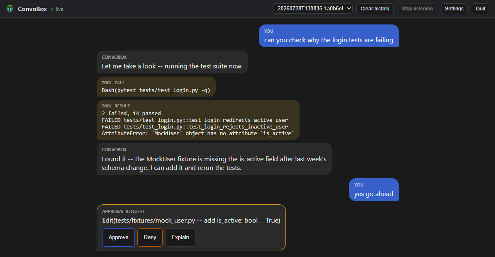
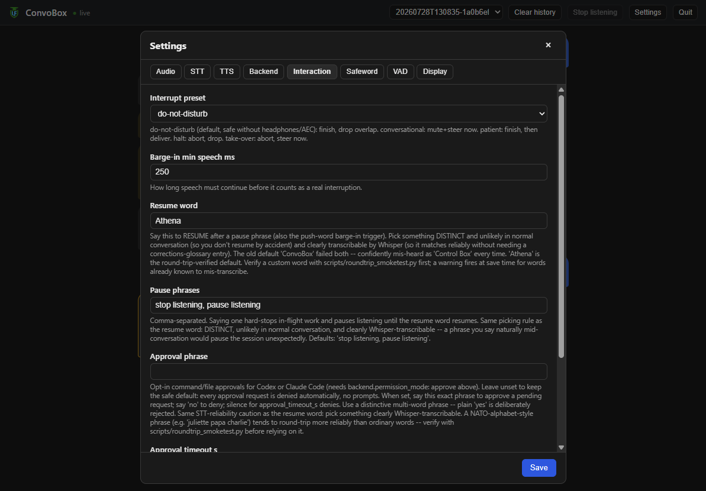
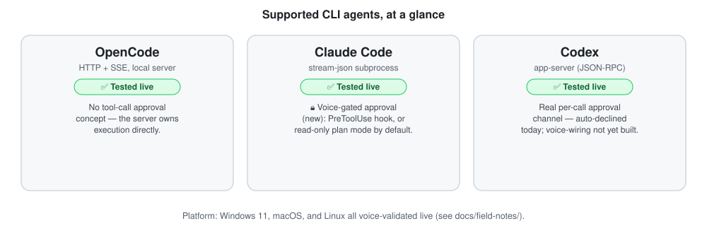
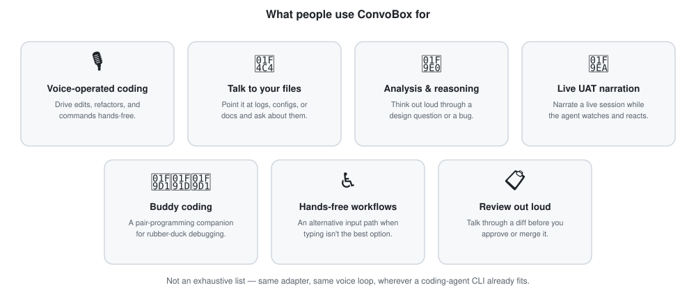
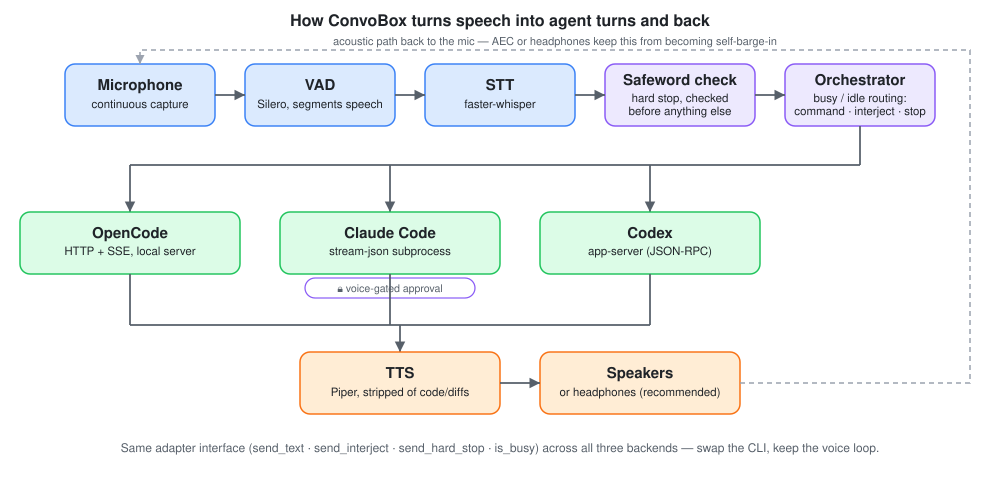

# LegionForge - ConvoBox

[](https://github.com/LegionForge/convobox/actions/workflows/ci.yml)
[](https://pypi.org/project/legionforge-convobox/)
[](LICENSE)
[](pyproject.toml)

A local, backend-agnostic voice frontend for CLI coding agents. It sits
between you and whichever coding agent CLI you're driving — Claude Code,
Codex, OpenCode, and eventually others — and lets you work by voice
instead of (or alongside) the keyboard.

> **Headphones strongly recommended for now.** Acoustic echo cancellation
> (open mic + speakers, no headphones) is still being dialed in — see
> [docs/DESIGN-echo-and-barge-in.md](docs/DESIGN-echo-and-barge-in.md)
> for the live tuning notes. Headphones sidestep the whole problem: the
> assistant's own voice never reaches the mic, so self-barge-in can't
> happen regardless of room acoustics. Open-speaker use works today but
> is the rougher edge of the experience.

AI-assisted change attribution is documented in
[docs/AI-ATTRIBUTION.md](docs/AI-ATTRIBUTION.md).
The repo also includes a commit template at [`.gitmessage.txt`](.gitmessage.txt)
for local AI-assisted commits.

## Quick Start

The fastest way to hear it work, no microphone required — no `git clone`
needed either, it's a real package:

```bash
pip install legionforge-convobox    # or: pipx install legionforge-convobox
```

Then a small `convobox.yaml` pointing at a backend you already have
working standalone (`opencode serve`, or `claude`/`codex` on your PATH):

```yaml
backend:
  name: opencode              # "opencode" | "claude-code" | "codex"
  url: http://localhost:4096  # opencode only
```

```bash
# start your backend first, e.g.: opencode serve
convobox --text "Reply with one short sentence: it works."
```

What that actually looks like (real output, `backend: claude-code` in this
case, verified against the actual published package — not run from a
source checkout):

```
2026-08-22 10:00:17 INFO backend permission_mode: plan (claude-code)
2026-08-22 10:00:19 INFO backend=claude-code  voice=af_sarah  safeword='stop stop stop'  pid=55596
2026-08-22 10:00:24 INFO response: It works.
```

If you hear a spoken reply, the whole pipeline (backend → TTS → speakers)
is working. Then go live and talk to it:

```bash
convobox
```

**Set `backend.working_dir`** to an isolated workspace before you do —
left unset, the agent runs (and can edit files) in whatever directory you
launched `convobox` from. ConvoBox warns at startup if you skip this; see
[docs/DESIGN-backend-sandboxing.md](docs/DESIGN-backend-sandboxing.md).

For picking a voice, finding the right audio device, and everything else
between "installed" and "talking to it comfortably," see the full
[docs/QUICKSTART.md](docs/QUICKSTART.md) walkthrough — it also covers
how to interrupt/abort by voice and what each listening state looks like.

Optional extras (GPU inference, AEC, the web UI, Piper) install the same
way: `pip install "legionforge-convobox[web]"`, for example — see
[Installation](#installation) below for the full list. **Contributing?**
That section also covers running from a source checkout.

## Installation

Just want to use it? `pip install legionforge-convobox` (see
[Quick Start](#quick-start) above) is the whole install — everything
below is for running from a source checkout: contributing, or the `dev`
extra's test/lint tooling, which isn't meaningful outside a clone.

**Prerequisites:** Python 3.12+, [git](https://git-scm.com/), and a
coding-agent CLI you can already reach on its own — OpenCode (runs a
local server), Claude Code, or Codex (both spawned as subprocesses).

```bash
git clone https://github.com/LegionForge/convobox
cd convobox
uv sync                    # or: pip install -e .
```

Optional extras, installed only if you want them:

```bash
uv sync --extra aec        # acoustic echo cancellation (WebRTC AEC3, Windows wheels)
uv sync --extra cuda       # GPU inference for STT (stt.device: cuda/auto), ~1GB, CUDA-only
uv sync --extra web        # local browser UI for a live session (--web), see below
uv sync --extra dev        # test/lint tooling
```

(Not running from source? The same extras install straight from PyPI:
`pip install "legionforge-convobox[web]"`, etc.)

ConvoBox never bundles a speech engine you didn't ask for — the default
STT model (faster-whisper) and TTS engine (Kokoro, Apache 2.0 — Piper is
available as an opt-in `--extra piper`, see below) download the first
time you actually use them, not at install time.

**Optional web UI:** `python scripts/run_convobox.py --web` starts a
local-only browser companion view of the live session — bubble-chat
transcript, tool calls/results, and pending approvals — alongside the
voice loop, off by default with no effect on anything else when unused.
Approve/deny/explain a pending tool call from the browser as an
alternative to speaking it, edit `convobox.yaml` settings from a full
in-browser editor (same validate/save/backup contract as
`scripts/settings_tui.py`), or end the whole session with a two-click
Quit button. See [docs/WEB-UI-USAGE.md](docs/WEB-UI-USAGE.md) for the
full picture, including its no-auth loopback-only security model.

**Still under construction as of 0.4.0.** The core flows above are
live-verified and working, but this is the newest, least-hardened part
of ConvoBox — expect rough edges (e.g. the artifact pane's opencode/codex
support isn't wired up yet) while it gets the same live-UAT scrutiny the
voice pipeline has already been through. See
[docs/KNOWN-ISSUES.md](docs/KNOWN-ISSUES.md) for the current list.





**Supported today:**



| Component | Status | Detail |
|---|---|---|
| **Windows 11** | Validated end to end | The reference platform. |
| **macOS** | Mostly validated | AEC, Kokoro TTS, the real mic loop, all three backends, and — with a real human speaker — the safeword hard-stop and barge-in are all confirmed live. Stays here pending browser-driven web-UI testing and sustained everyday use. |
| **Linux** | Mostly validated | AEC (N=10 volume sweep, twice), Kokoro TTS, the real mic loop, and TUI/text/Web UI (real browser-driven testing) are all confirmed live; with a real human speaker, the claude-code backend's safeword hard-stop, `kill_phrase`, and self-barge-in are confirmed live too. OpenCode confirmed live only at the adapter level so far (no real mic session yet); Codex not yet live-tested on this platform. A live acoustic safety-phrase sweep also found some phrases (e.g. "abort abort abort", and Kokoro's own rendering of "eject eject eject") less reliable via synthesized voices than assumed — see docs/field-notes/. Stays here pending those backend/phrase gaps and sustained everyday use. |
| **Backends** | All three validated | opencode (HTTP+SSE), Claude Code (stream-json), Codex (app-server) — each driven through the full voice loop, including tool use. |
| **STT** | faster-whisper | Validated on all three tested platforms. |
| **TTS** | Kokoro (default), Piper (opt-in) | Kokoro confirmed in live voice sessions with real speakers. |

Two open gaps worth knowing before you lean on the safety path:

- **`kill_phrase` does not reach a deliberately detached process on
  Windows.** It ends the session and kills whatever the backend still has
  structurally attached, but a child the agent backgrounds on purpose can
  survive. Confirmed live against `codex`; not yet tested on the other two
  backends. Note an automated harness does *not* reproduce this, so the
  test suite alone doesn't cover it.
- **A rare mic-layer freeze** — one occurrence to date, self-resolving,
  root cause not established.

Both are detailed in [docs/KNOWN-ISSUES.md](docs/KNOWN-ISSUES.md), which
also covers the WASAPI audio-output issue on Windows and every other
diagnosed problem, indexed by component, platform, and severity.
[docs/STATUS.md](docs/STATUS.md) carries the dated narrative of how the
project got here; [CHANGELOG.md](CHANGELOG.md) is the formal per-release
log.

**A safety note before you configure a backend:** ConvoBox defaults to
`permission_mode: plan` — read, explore, and explain only, no edits and no
commands — because a headless agent has no way to answer a permission
prompt at runtime. `approve` lets it act but gates each risky call on a
spoken approval phrase. `permissive` removes every check, so only use it in
a context you'd trust an unsupervised agent with: voice input can be
misheard. Full per-backend behavior, and the two gotchas that bite people,
in [docs/PERMISSION-MODEL.md](docs/PERMISSION-MODEL.md).

## Uninstallation

ConvoBox never installs any service, daemon, or registry/system entry —
just the package (or the cloned source) plus whatever it downloaded. To
remove it:

1. **Installed via `pip`/`pipx`?** `pip uninstall legionforge-convobox`
   (or `pipx uninstall legionforge-convobox`). Also delete `convobox.yaml`
   wherever you kept it — it isn't installed alongside the package.
2. **Installed from source?** Delete the project folder — this removes
   the cloned source, the `uv`/`pip` virtual environment, your
   `convobox.yaml`, and any downloaded TTS files (Kokoro's model/voices at
   `.models/kokoro/`, or Piper voices at `.models/piper/` if you opted
   into that extra).
3. **Optional — reclaim the STT model cache.** faster-whisper downloads
   its speech-to-text model into the shared Hugging Face cache
   (`~/.cache/huggingface` on Linux/macOS, `%USERPROFILE%\.cache\huggingface`
   on Windows), not into the project folder. Only delete this if you don't
   need it for other Hugging Face–based tools — it isn't ConvoBox-specific.

## What ConvoBox does

**This is a developer tool, not a general-purpose voice assistant.**
ConvoBox has nothing to say if you don't already run a coding-agent CLI —
there's no standalone use case for it today, by design rather than by
oversight. If that changes, it'll be a deliberate new target added
alongside this one, not a reframing of what's here.

ConvoBox is not tied to any single backend: the goal is a portable voice
setup you can point at whatever coding-agent CLI you're using that day,
rather than a feature bolted onto one product. A thin adapter interface
(`send_text`, `send_interject`, `send_hard_stop`, `is_busy`) is
implemented per backend, preferring each tool's native structured/headless
interface over scraping terminal output.



Not an exhaustive list — the same adapter and voice loop apply wherever a
coding-agent CLI already fits into how you work.

## Direction

- **Natural, full-duplex conversation, not push-to-talk.** Continuous
  listening with voice-activity detection, not hold-a-key-to-talk. You
  should be able to interject the way you would with a person, not wait for
  a turn.
- **Local-first.** Speech-to-text and text-to-speech run on-device by
  default. No audio has to leave the machine for the core loop to work.
  This isn't just a privacy preference: it avoids metered cloud STT/TTS
  billing, keeps the raw voice-processing step out of the token budget of
  whatever coding agent you're actually talking to, and gives you a local
  pipeline you can tune to your own voice. "Local" doesn't mean "hardcoded
  to the device in front of you," though — the capture/indicator layer and
  the actual STT/TTS compute should stay decoupled, so the heavy
  processing can later run on a beefier machine on your own private
  network (e.g. via Tailscale) with a thin client on a laptop or phone,
  without leaving infrastructure you control.
- **Backend-agnostic by design.** Same adapter interface as above,
  preferring each tool's native structured/headless interface (e.g.
  streamed JSON events, an HTTP+SSE server) over scraping terminal
  output, with a PTY/keystroke fallback where nothing better exists.
- **Two distinct interrupt semantics.** A *soft interject* ("oh, also—")
  shouldn't derail a long-running task; a *hard stop* (a deliberate,
  deterministic safeword) should abort it immediately. These are modeled
  separately rather than collapsed into one "interrupt" action.
- **Voice-aware, not voice-restricted, risk policy.** Destructive actions
  can warrant stricter confirmation when triggered by voice, given STT
  misrecognition and ambient-pickup failure modes that keyboard input
  doesn't have. That default should be configurable per user, not
  hardcoded — the same agency a keyboard session already has should be
  available on the voice side too.

## Status

**0.4.0 — the first packaged release, on PyPI as `legionforge-convobox`.**
All three backend adapters run the full voice loop including
tool use; the support matrix above is the current picture of what's
validated where. Linux parity and remaining macOS validation are on the
roadmap ([docs/ROADMAP.md](docs/ROADMAP.md)).

The voice pipeline is the hardened part. The web UI is the newest and
least-hardened, and the safety path has two open gaps listed above. For how
the project got here — the interaction/safety bundle, the security and
performance audit, the freeze investigation — see
[docs/STATUS.md](docs/STATUS.md) for the narrative and
[CHANGELOG.md](CHANGELOG.md) for the per-release log.

## Architecture



Audio capture (continuous mic input, VAD-segmented into utterances) feeds
local STT, which is checked for a deterministic safeword before anything
else touches it. An orchestrator tracks each backend's busy/idle state
and routes an utterance as a fresh command, a soft interject, or a hard
stop through one of three backend adapters — OpenCode, Claude Code, or
Codex — each verified against a live instance. Backend replies stream
back through local TTS, stripped of code/diffs in favor of spoken prose.

See [docs/ARCHITECTURE.md](docs/ARCHITECTURE.md) for the full pipeline
diagrams, the component stack, and pointers into the codebase (including
three [CodeTour](https://marketplace.visualstudio.com/items?itemName=vsls-contrib.codetour)
walkthroughs in `.tours/`).

## Roadmap

Rough phased direction, not commitments: a native desktop client first,
then a browser client talking to a networked server over your own
private network, with mobile deprioritized but not designed away. Full
detail, including the near-term feature roadmap (pluggable STT/TTS
engines, safety tiers for destructive actions, wake word, session
persistence), is in [docs/ROADMAP.md](docs/ROADMAP.md).

## Prior art

ConvoBox is not the first attempt at voice-driven coding agents —
[VoiceMode](https://github.com/mbailey/voicemode),
[duck_talk](https://github.com/dhuynh95/duck_talk),
[AgentsRoom](https://agentsroom.dev/) (priced, cloud-routed, 8 CLIs), and
the built-in `/voice` in Claude Code, Codex CLI, and Aider are the
closest relatives, but none combine backend-agnostic, local-first (both
directions), full-duplex, *and* voice-native safety gating (spoken
safeword hard-stop, voice approval-gating for destructive actions) in
one project. See [docs/PRIOR-ART.md](docs/PRIOR-ART.md) for the full
comparison, reusable building blocks, and [docs/LESSONS-FROM-VOICE-OPENCODE.md](docs/LESSONS-FROM-VOICE-OPENCODE.md)
for what an earlier, unreleased attempt at this same problem got wrong.

## Credits & attributions

ConvoBox is built on other people's code, models, and research. See
[CREDITS.md](CREDITS.md) for acknowledgments — the software and models it
depends on, the conversation-design research behind its turn-taking/barge-in
behavior ([docs/CONVERSATION-DESIGN-REFERENCES.md](docs/CONVERSATION-DESIGN-REFERENCES.md)),
and the voice-assistant interaction patterns it deliberately mirrors.

## License

MIT — see [LICENSE](LICENSE). Free for everyone, personal and commercial
use alike, in the spirit of the mostly MIT/BSD/Apache-2.0 dependencies
this project is built on. A split free/paid licensing model was
researched and considered, then decided against in favor of staying a
single, simple, unencumbered open-source project.

If you find ConvoBox useful, [donations to LegionForge](https://legionforge.org/donations)
help support ongoing development — entirely optional, never required.

The technical item this decision depended on is now fixed (2026-07-24):
the default TTS engine is Kokoro (Apache 2.0, code and model weights),
not `piper-tts`. Piper remains available as an explicit opt-in extra
(`uv sync --extra piper`) for anyone who wants it, but a plain `uv sync`/
`pip install .` never pulls in GPL-3.0 code, so a default ConvoBox
install/distribution stays cleanly MIT. See
[DEPENDENCY_LICENSE_AUDIT.md](DEPENDENCY_LICENSE_AUDIT.md) for the full
audit, including one deliberate deviation from its own original
recommendation (keeping Piper in the codebase as opt-in, rather than
removing it entirely) and what's still not independently verified
(individual Kokoro voice files' own licenses).
