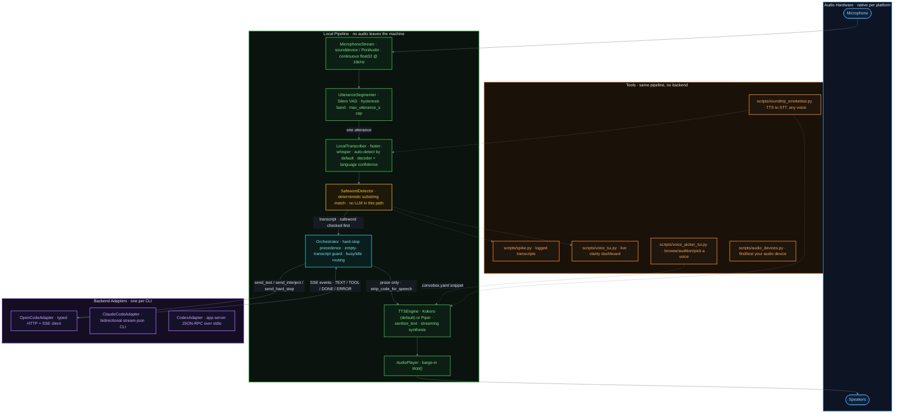
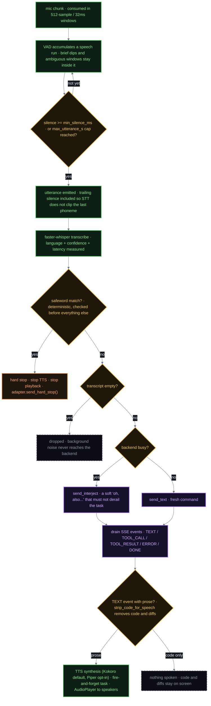

# Architecture

The full pipeline diagrams, component breakdown, and codebase walkthroughs
that don't fit in the README's condensed overview.

- **Audio capture** — continuous mic input, segmented into utterances by a
  neural voice-activity detector (tolerant of pauses/disfluencies).
- **Local STT** — transcribes each segment on-device.
- **Safeword detection** — deterministic keyword-spotting over each
  transcript, intentionally kept out of any LLM's hands so a hard stop
  can't be second-guessed by a model.
- **Orchestrator** — tracks each backend's busy/idle state and routes an
  utterance as a fresh command, a soft interject, or a hard stop.
- **Backend adapters** — one per target CLI, translating the orchestrator's
  intent into whatever that tool actually understands, preferring each
  tool's native structured/headless interface over PTY scraping. Three are
  implemented: **OpenCode** (typed client over its HTTP+SSE server),
  **Claude Code** (bidirectional stream-json subprocess), and **Codex**
  (app-server JSON-RPC over stdio), each verified against a live instance.
  OpenCode's real API shape (the endpoint paths were wrong in an early
  assumed version, then corrected against a real `opencode serve`) is
  documented in [../OPENCODE_API_NOTES.md](../OPENCODE_API_NOTES.md).
- **Local TTS** — streams spoken responses back, filtering out raw
  code/diff output in favor of prose summaries.
- **Optional local LLM cleanup pass** between STT and the adapter, to fix
  mangled technical vocabulary — under evaluation, not assumed necessary.
  See [STATUS.md](STATUS.md).

## One utterance, end to end

## Component software

Current candidate stack for the local pipeline:

- Python, managed with [uv](https://github.com/astral-sh/uv)
- [sounddevice](https://github.com/spatialaudio/python-sounddevice) — audio
  capture
- [Silero VAD](https://github.com/snakers4/silero-vad) — speech
  segmentation
- [faster-whisper](https://github.com/SYSTRAN/faster-whisper) — local
  speech-to-text
- A local TTS engine — Kokoro (Apache 2.0, default since 2026-07-24) or
  Piper (GPL-3.0, opt-in only via `uv sync --extra piper`, kept out of
  the default install for exactly the licensing reason this section used
  to flag as unresolved — see
  [../DEPENDENCY_LICENSE_AUDIT.md](../DEPENDENCY_LICENSE_AUDIT.md)).
  Whatever the choice, response text must never be interpolated directly
  into a shell command to invoke it — see
  [LESSONS-FROM-VOICE-OPENCODE.md](LESSONS-FROM-VOICE-OPENCODE.md).
- [Ollama](https://ollama.com) — for the optional local LLM cleanup pass,
  if testing shows it's warranted

## Reviewing this codebase?

`.tours/` has three [CodeTour](https://marketplace.visualstudio.com/items?itemName=vsls-contrib.codetour)
walkthroughs (VS Code will prompt to install the extension via
`.vscode/extensions.json`): *1. Architecture & Data Flow* follows one
utterance through every pipeline stage with the data handoff called out at
each boundary; *2. Review Findings: Security & Performance* visits the
concrete bugs a review pass found and fixed, in place; *3. Extension
Points: Modularity & Pluggability* shows collaborators exactly where to
plug in a new backend adapter or TTS engine, and — just as important —
which modules are deliberately single-implementation, not extension
points. Each step is anchored by both a line number and a text pattern so
the tour stays accurate as the code around it changes — see the comment
at the top of any `.tour` file if you're adding a new step.
