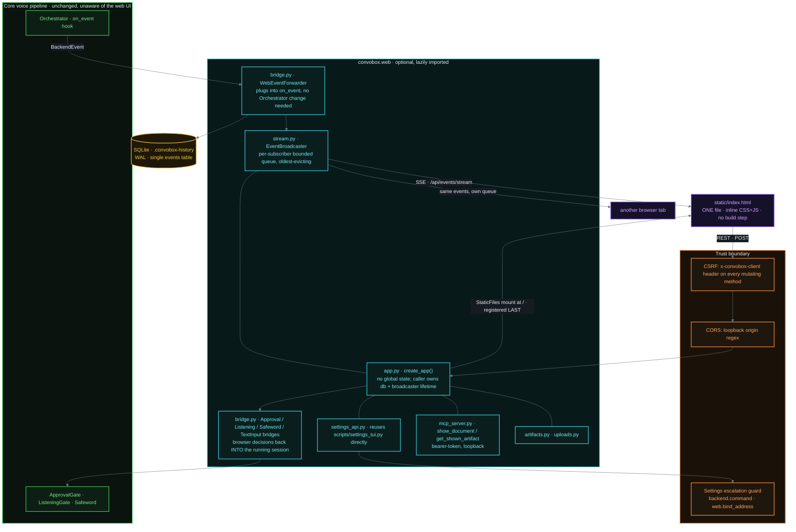
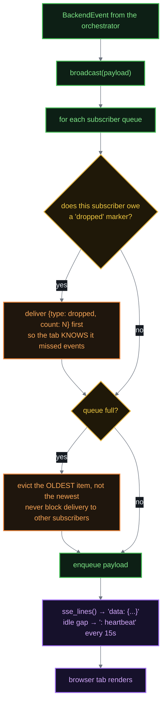
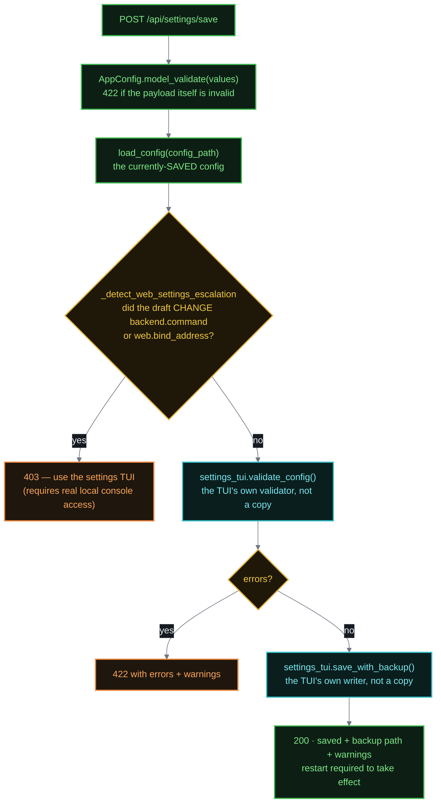

# ConvoBox Web UI Architecture

What the optional browser companion actually is, as built. For using it see
[WEB-UI-USAGE.md](WEB-UI-USAGE.md); for working on it see
[WEB-UI-DEV.md](WEB-UI-DEV.md).

**In one sentence:** a FastAPI app that taps the orchestrator's existing
`on_event` hook, fans events out to any number of browser tabs over
Server-Sent Events, optionally persists them to SQLite, and serves a single
static HTML file as the entire frontend.

It is **opt-in** (`web.enabled` or `--web`), **loopback-only**, and
**unauthenticated by design** — a same-machine trust model, not an
oversight. When unused it has zero effect on the core voice pipeline; the
`fastapi`/`uvicorn` imports are lazy, behind the optional `web` extra.

---

## Component map

### Why it attaches this way

`Orchestrator` already had an `on_event` extension point, so wiring the web
UI required **no change to the orchestrator at all** — `WebEventForwarder`
is just a callable that plugs into it. That is the reason the web UI can
claim zero effect on the core pipeline: there is no core-pipeline code that
knows it exists.

Traffic in the other direction (a browser approving a tool call, pausing
listening, hard-stopping, typing text) does not go back through
`on_event`. It goes through dedicated bridge objects that hold references to
the live gates, so a browser decision and a spoken decision land on exactly
the same mechanism.

---

## The frontend is one file

`src/convobox/web/static/index.html` — inline CSS and JavaScript, no
framework, no bundler, no `package.json` anywhere in the repository, no
build step in CI or packaging. It is mounted by `create_app()` as a
Starlette `StaticFiles` mount at `/`, registered **after** every `/api/*`
route so ordinary route-registration order (not special-casing) keeps it
from shadowing the API. A dedicated test,
`test_static_mount_does_not_shadow_api_routes`, asserts exactly that.

All event content is written with `textContent`, never `innerHTML` —
backend responses, tool output, and transcripts are untrusted content.

The single-file choice is deliberate and load-bearing: it survives
`uv build --wheel` with no packaging configuration (hatchling includes it by
default), and it means a contributor can edit the UI with no toolchain
installed.

---

## Event fan-out

One `EventBroadcaster`, one bounded `asyncio.Queue` per subscribed browser
tab. A shared single queue would deliver each event to whichever *one*
consumer drained it first — silently wrong the moment a second tab opens.

Queues are bounded (`max_queue_size`, default 200) because a subscriber that
stops draining — a backgrounded or suspended tab that is still TCP-connected
— would otherwise grow its queue for the rest of the session.

Two details that exist for real reasons:

- **Evict oldest, not newest.** Dropping the newest would make a stalled tab
  permanently stuck in the past; dropping the oldest keeps it current.
- **The `dropped` marker.** An evicted subscriber receives
  `{"type": "dropped", "count": N}` on its next delivery, so the frontend can
  say it missed events rather than silently falling behind with no signal.
- **Heartbeats.** An idle SSE connection emits a `: heartbeat` comment every
  15s, because some proxies and browsers close a connection with no bytes
  for 30–60s.

---

## HTTP surface

All routes are registered by `create_app()` in `app.py` unless noted.

| Group | Routes | Notes |
|---|---|---|
| Health | `GET /health` | |
| Session data | `GET /api/sessions`, `GET /api/sessions/{id}/events`, `POST /api/sessions/{id}/clear`, `GET /api/sessions/{id}/export` | History read/clear/export |
| Live stream | `GET /api/events/stream` | SSE; one queue per connection |
| Session control | `POST /api/quit`, `POST /api/stop`, `GET`/`POST /api/listening`, `POST /api/text` | Drives the live session |
| Approvals | `POST /api/sessions/{id}/approval` | `approve` / `deny` / `explain` |
| Display config | `GET /api/config` | Per-role colors/names |
| Settings | `GET /api/settings`, `POST /api/settings/{schema,validate,save,test}` | `settings_api.py` |
| Artifacts | `GET /api/artifacts`, `POST /api/artifacts/active`, `GET /api/artifacts/{path}`, `GET /api/artifacts/{path}/editor-uri` | `artifacts.py` |
| Uploads | `POST /api/upload` | `uploads.py` |
| MCP | mount at `/mcp` | `mcp_server.py`, bearer-token gated |
| Frontend | `StaticFiles` mount at `/` | Registered last |

---

## Settings: parity by reuse, not reimplementation

`settings_api.py` does **not** reimplement validation or saving. It imports
`scripts/settings_tui.py` and calls that module's own
`SECTION_SPECS`, `_visible_fields_for_section`, `_choices_for`,
`validate_config`, `save_with_backup`, and `probe_*` functions directly.

This is the mechanism that makes the browser editor and the terminal TUI
incapable of silently drifting apart on what counts as valid, or on how a
save is written (`exclude_defaults`, backup-then-atomic-replace). Field
choices come from the TUI's own live enumeration — real connected devices,
real downloaded voices — and its sentinel strings (e.g. `(system default)`
for a `None` device) are surfaced to the frontend as `unset_value` /
`unavailable_value` rather than being hardcoded in JavaScript where they
would drift.

`scripts.settings_tui` is imported lazily **inside each route body**, not at
module top level: importing it pulls in faster-whisper, kokoro, and
sounddevice, which is needless weight for the many routes, tests, and
`app.py` imports that never touch settings.

Every save writes `config_path` directly and reloads fresh on every `GET`.
There is no hot-reload — `run_convobox.py` reads `convobox.yaml` only at
startup — so a save here needs a manual restart to take effect, exactly like
a TUI save.

### The escalation guard

Two fields are categorically higher-stakes than everything else in the
config, and this route refuses to change either:

- **`backend.command`** is a list passed straight to
  `asyncio.create_subprocess_exec` — editing it is
  arbitrary-command-execution-on-next-start.
- **`web.bind_address`** controls whether this same unauthenticated server
  is reachable beyond loopback — editing it is self-escalation to LAN
  exposure.

Both stay fully editable through `scripts/settings_tui.py`, which requires
real local console access. The restriction is specific to the *web route*,
not to the config model or the save mechanism.

The check compares the draft against the currently-saved config rather than
merely testing whether the payload *contains* those fields: the save flow
round-trips the full config back with edits merged in, so the fields are
always present in a normal payload. Only an actual attempted change is
rejected. (GitHub issue #235, finding A4.)

---

## Security model

The whole surface assumes **one trusted user on one machine** -- remote
access is a different design problem (see [ROADMAP.md](ROADMAP.md)'s
deployment phases), not a missing feature here. Until 2026-09-01 that
translated to "no authentication and no plan for one at this layer";
an independently cross-verified security review found that assumption
didn't hold up (a same-origin artifact, or any other local process that
knew the CSRF header's constant value, had the same standing as this
page's own trusted JS), so real per-session authentication was added.

- **Bind address.** Defaults to loopback. `WebConfig`'s validator rejects a
  specific non-loopback address outright, while still permitting `0.0.0.0`
  as a deliberate explicit choice.
- **Auth token (2026-09-01).** A random per-session bearer token
  (`secrets.token_hex(16)`, `run_convobox.py`), the same "random token
  over a loopback channel" shape already used for the MCP mount and the
  approval-hook TCP server, not a new pattern. Embedded in the URL this
  session prints (`http://host:port/?token=...`); `index.html` reads it
  back out of its own address bar once at load (`AUTH_TOKEN`) and
  attaches it to every `/api/*` call via `apiFetch()`'s `Authorization:
  Bearer` header, or as a `?token=` query param for the handful of
  GET-by-URL cases a browser can't attach a custom header to
  (`EventSource`, the artifact pane's ``/`<iframe src>`/
  download-link URLs). Deliberately NOT a cookie: a cookie is attached
  by the browser automatically regardless of which page triggered the
  request (subject to `SameSite`, and exactly what a DNS-rebinding
  attacker page exploits) -- a bearer token/query param requires the
  calling JS to already know the value, which only this page's own
  trusted JS (having read it from the real address bar) does. Checked
  on `/api/*` only, via `require_web_ui_token`
  (`src/convobox/web/app.py`) -- the static HTML/JS/CSS shell itself
  isn't sensitive, matching a Jupyter-style login flow that serves its
  shell unauthenticated but gates the actual API. `/mcp` is exempt
  (already has its own independent bearer-token auth below).
- **CORS.** Loopback origins on the ACTUAL bound port only, when known
  (`create_app`'s `port` param) -- narrowed 2026-09-01 from "any
  loopback origin, any port" (`^https?://(127\.0\.0\.1|localhost)(:\d+)?$`),
  which trusted every other local process/page that happened to bind a
  port, not just this app's own frontend. The auth token above is the
  real control now; this is defense in depth on top of it.
- **CSRF.** Every mutating method (`POST`/`PUT`/`PATCH`/`DELETE`) requires an
  `x-convobox-client` header. CORS alone was not enough: `/api/quit`,
  `/api/stop`, and `/api/sessions/{id}/clear` take no request body, which
  makes a cross-origin `fetch(url, {method:"POST"})` a CORS *simple request*
  that the browser sends with no preflight. CORS controls whether an
  attacking page can **read** the response; it never stops the request being
  sent. Those three routes' real side effects — kill the session, hard-stop,
  wipe history — were reachable from any tab. The JSON-bodied routes were
  protected only incidentally (a JSON content-type forces a preflight), an
  accident of body shape rather than a designed control, and a future
  body-less route would have silently reopened the gap. (GitHub issue #235,
  finding A3.) Superseded in practice by the auth token above (a request
  without the right token never reaches this check's routes at all), kept
  as an independent layer rather than removed.
- **Settings escalation guard.** As above.
- **Artifact CSP sandbox (2026-09-01).** HTML/SVG artifacts get a
  `Content-Security-Policy: sandbox allow-scripts` response header
  (`src/convobox/web/artifacts.py`). The in-pane render path
  (`<iframe sandbox="allow-scripts">`, deliberately no
  `allow-same-origin`) was already safe, but the artifact browser's
  "Open in new tab" link opens the same URL as a plain top-level
  navigation with no sandbox at all -- full same-origin standing, so an
  attacker-influenced artifact's own script could `fetch()` any `/api/*`
  route with this page's own trusted-JS standing. The CSP header
  achieves the same isolation (unique opaque origin, script still runs)
  for a top-level navigation that the iframe attribute can only achieve
  for an embedded frame.
- **MCP server.** Mounted at `/mcp` behind a random per-session bearer
  token, generated in `run_convobox.py` and handed to the CLI via
  `--mcp-config`'s `headers` field.
- **XSS.** Frontend renders exclusively via `textContent`.
- **Data at rest.** History is plain unencrypted SQLite (WAL) in the working
  directory, gitignored by default, and contains raw transcripts, approved
  commands, and tool output. See [SECURITY.md](SECURITY.md).

Every control-plane capability the browser has — approve/deny, quit,
stop/resume listening, settings-save — was a deliberate, individually
reviewed extension of this trust model rather than incidental scope creep.
The riskiest of them (stop/resume listening, which hard-stops in-flight work
exactly as a spoken pause phrase does) shipped in its own commit with its
re-verification stated, per this repo's safety-critical-rides-alone rule.

---

## Storage

One table, `events`, in a WAL-mode SQLite database. Columns:
`id`, `session_id`, `timestamp` (REAL, sub-second), `event_type`,
`user_transcript`, `backend_response`, `tool_name`, `tool_input`,
`approval_explanation`, `user_decision`, `backend_event_json`, `created_at`.
Indexed on `(session_id, timestamp)` and on `event_type`.

Two ordering details, both discovered through real test failures rather than
designed up front:

- `list_sessions()` / `get_active_session()` order by the sub-second
  `timestamp` REAL column, **not** `MAX(created_at)` — that column is
  second-resolution text, which ties and then sorts unspecified for two
  sessions touched within the same second.
- `get_session_events()` returns **oldest first**, chat reading order.

History persistence is itself opt-in (`web.history_tracking_enabled`,
default off), separately from the web UI being enabled.

---

## Current state

Built and live-verified: transcript view, live SSE, bubble-chat layout,
branded ribbon, per-role colors/names, approve/deny/explain, quit,
stop/resume listening, activity-status indicator, session picker, clear
history, export, full settings editing with Test-probe wiring, PWA install
support, file upload, and the artifact pane.

The artifact pane is wired end to end for **Claude Code** only (`Write` /
`Edit` tool calls, confirmed against the matching `tool_result` before an
`ARTIFACT` event fires). **codex and opencode remain unwired** — opencode is
blocked on one small live-verification step (confirming its `file.edited`
event's path format), not on guesswork. See
[ARTIFACT-PANE-SCOPE.md](ARTIFACT-PANE-SCOPE.md), and note that the
artifact-pane MCP tools are unavailable under the default
`permission_mode: plan` ([PERMISSION-MODEL.md](PERMISSION-MODEL.md)).

Known open items are tracked in [KNOWN-ISSUES.md](KNOWN-ISSUES.md)'s Web UI
section. Restart-on-demand is deliberately not built — it is a real
security-posture decision that has not been made, not an oversight.

---

## A note on this document's own history

Through 0.3.1 this file led with a speculative design sketch — a
React/Vue frontend with a `components/*.tsx` tree, a `package.json`, and
TypeScript hooks — none of which was ever built, alongside a CORS
configuration and an event-broadcast design that were both actively wrong.
Corrections accumulated hundreds of lines below the claims they corrected,
so a reader (or a model) scraping the top of the file came away believing
ConvoBox had a React frontend.

It has been rewritten to describe only what exists. The corrections worth
keeping now live at the point of implementation, as comments in `app.py`
and `stream.py`; the dated build narrative lives in [STATUS.md](STATUS.md)
and the git history.

The lesson is worth stating plainly, because this document is the evidence:
**an architecture doc that is allowed to describe intentions in the present
tense will eventually lie.** Its very first version pre-checked every item
in its own implementation checklist before any of it existed. Describe what
is built; put what is planned in [ROADMAP.md](ROADMAP.md).
